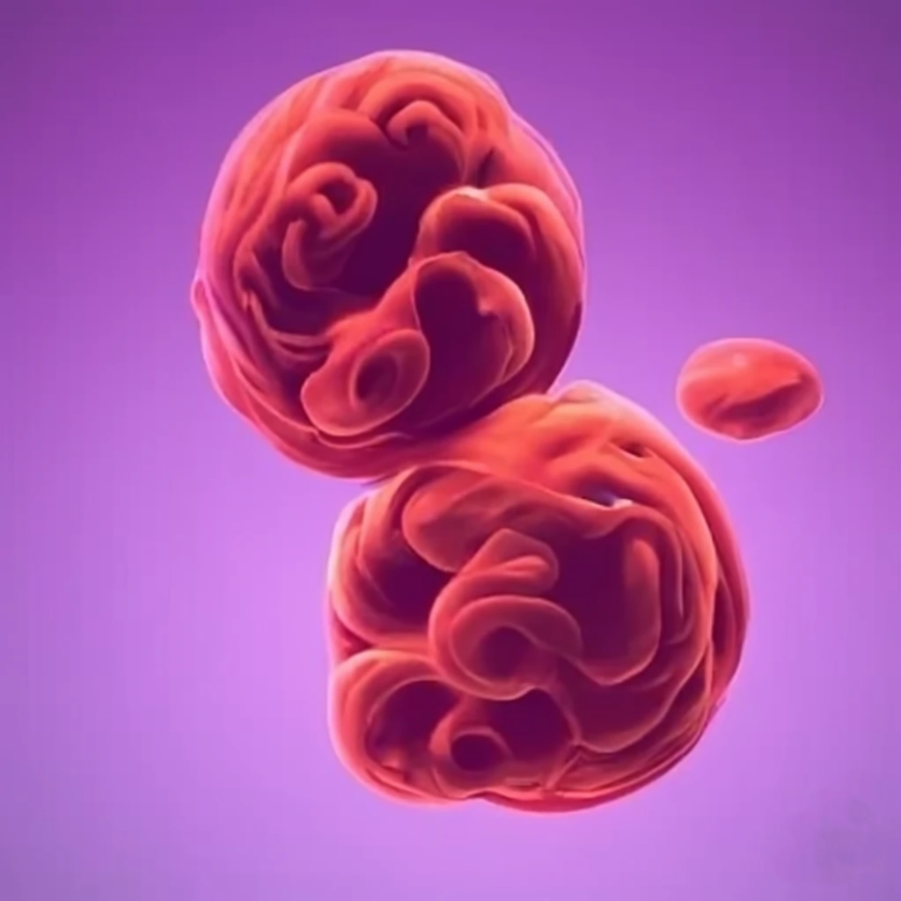

<!-----
header-includes:
  - \hypersetup{colorlinks=true}
----->

# Causal Learning Reading Group (Summer 2023)

- Leaders: [Anshuman Suri](anshumansuri.me) and [Hannah Chen](https://hannahxchen.github.io/)
- Location: TBD
- Time: TBD
- TA: N/A
- Discussion forum: [Slack](https://join.slack.com/t/slack-xxr1309/shared_invite/zt-1vouao6xg-bh0NsLQqglztr40Y_5ehiw)

**Highlights**

- [Course schedule](files/schedule.md)
- [Reading list](files/reading-list.md)

## 1. Description

### 1.1 Objectives

TBD

<!-- This course will cover some advanced materials on natural language processing and machine learning. The majority of this course includes presentations of academic papers published on recent top-tier NLP and machine learning conferences.

The objectives of this course is to provide opportunities to

1. understand the recent progress of natural language processing and some related machine learning methods
2. study the reproducibility of deep learning for NLP
3. practice writing and presentation skills -->

### 1.2 Prerequisites

This reading group will start by covering the basics of causal learning, and transition to more advanced topics and applications in machine learning.

## 2. Schedule

Schedule with topics can be found on [this page](files/schedule.md)

## 3. Readings

For a list of useful resources and papers that we discussed in the reading group, please refer to [this page](files/reading-list.md).
